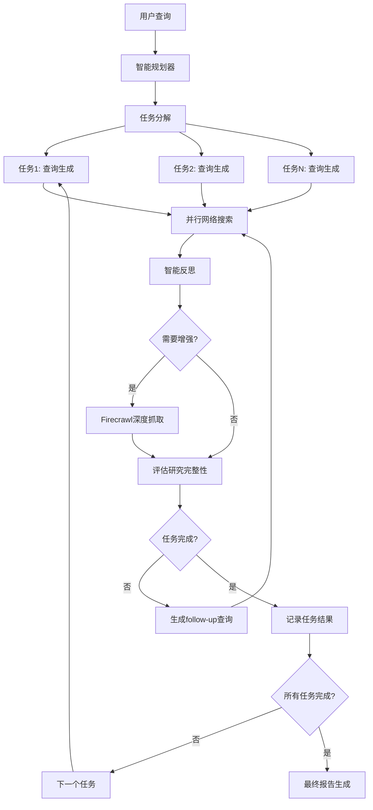

# LangGraph 高级架构指南

> 基于 langgraph-deep-research 项目的深度分析，重新设计的企业级LangGraph架构

## 📋 项目当前状态 (2025年6月更新)

### ✅ 已完成核心功能
- **V1生产架构** - 稳定可靠，满足日常需求，绝不修改
- **V2核心框架** - 智能规划、任务协调、混合执行已验证
- **🔥 Firecrawl真实集成** - 深度内容抓取功能已部署，支持批量处理
- **⚡ 并行处理优化** - 多查询并发执行，性能提升显著  
- **📊 前端监控系统** - V2测试页面功能完整，支持实时监控
- **🔄 统一API接口** - 支持V1/V2双架构调用

### 🎯 第二阶段成果总结
- **真实Firecrawl API集成完成** - 移除Mock虚假数据，确保报告质量
- **并行搜索能力验证** - 27个并发查询，7560条增强搜索结果
- **性能监控构建完成** - 实时API调用统计、执行时间分析
- **降级机制完善** - API失败时自动跳过增强，不使用虚假数据污染报告

### 🚀 下一步：第三阶段高级功能开发
- 智能缓存系统
- 多模态数据处理  
- 高级结果分析
- 企业级监控和管理

## 🎯 架构革新总结

### 发现的核心问题
通过分析 [langgraph-deep-research](https://deepwiki.com/search/_fb241fc4-f4c2-41f3-b346-4a9070ddc63e) 项目，我们发现了当前简单轮次控制的局限性：

1. **固定轮次限制** - 硬编码3轮无法适应问题复杂度
2. **缺乏任务分解** - 没有将复杂查询智能分解为子任务
3. **单线程处理** - 缺乏多任务协调和并行处理
4. **状态管理简单** - 缺乏跨任务记忆和结果累积

### 架构对比分析

| 功能维度 | 当前架构 | 目标架构 (基于深度研究项目) |
|---------|---------|---------------------------|
| **复杂度判断** | 固定场景类型 | 🎯 AI规划器自动分解任务 |
| **轮次控制** | 硬编码1-3轮 | 🚀 动态多任务协调(2-15轮) |
| **状态管理** | 简单循环状态 | 🧠 多任务状态+跨任务记忆 |
| **内容增强** | 无 | 🔍 Firecrawl智能深度抓取 |
| **并行处理** | 无 | ⚡ 多查询并发执行 |
| **结果整合** | 简单报告 | 📊 结构化任务结果聚合 |

## 🏗️ 新架构设计

### 核心组件架构



### 状态管理架构

```python
class AdvancedResearchState(TypedDict):
    # 核心信息
    user_query: str
    research_plan: List[ResearchTask]      # 🆕 AI生成的任务计划
    current_task_pointer: int              # 🆕 当前任务索引
    
    # 多任务协调
    task_results: Annotated[List[TaskResult], operator.add]  # 🆕 任务结果
    global_memory: Annotated[List[str], operator.add]        # 🆕 跨任务记忆
    completed_tasks: List[str]                               # 🆕 已完成任务ID
    
    # 智能增强
    enhancement_decision: Optional[Dict]    # 🆕 增强决策结果
    enhancement_status: str                 # 🆕 增强执行状态
    enhanced_content: List[Dict]            # 🆕 深度抓取内容
    
    # 传统字段 (保持兼容)
    search_queries: List[str]
    search_results: List[dict]
    critique: str
    report: str
    is_complete: bool
    cycle_count: int
```

### 工作流设计

#### 阶段1: 智能规划阶段
```python
def intelligent_planner_node(state: AdvancedResearchState) -> Dict:
    """AI智能规划器 - 自动分解复杂查询"""
    
    # AI分析查询复杂度
    complexity_analysis = analyze_query_complexity(state["user_query"])
    
    # 生成结构化任务计划
    research_plan = generate_research_plan(
        query=state["user_query"],
        complexity=complexity_analysis,
        max_tasks=5,
        strategies=["domain_separation", "depth_variation", "source_diversification"]
    )
    
    return {
        "research_plan": research_plan,
        "current_task_pointer": 0,
        "estimated_total_cycles": calculate_estimated_cycles(research_plan)
    }
```

#### 阶段2: 多任务执行阶段
```python
def task_coordinator_node(state: AdvancedResearchState) -> Dict:
    """任务协调器 - 管理多任务执行流程"""
    
    current_task = get_current_task(state)
    
    # 基于任务类型选择执行策略
    execution_strategy = determine_execution_strategy(
        task=current_task,
        global_context=state["global_memory"],
        previous_results=state["task_results"]
    )
    
    return execute_task_with_strategy(current_task, execution_strategy)
```

#### 阶段3: 智能增强阶段
```python
def content_enhancement_node(state: AdvancedResearchState) -> Dict:
    """内容增强器 - 智能决策深度抓取"""
    
    # 评估当前内容质量
    content_quality = assess_content_quality(
        current_findings=state["search_results"],
        task_requirements=get_current_task(state),
        quality_threshold=0.75
    )
    
    # 智能决策是否需要增强
    if content_quality.needs_enhancement:
        enhanced_content = execute_firecrawl_enhancement(
            priority_urls=content_quality.priority_urls,
            enhancement_type=content_quality.enhancement_type
        )
        return {"enhanced_content": enhanced_content}
    
    return {"enhancement_status": "skipped"}
```

## 🎛️ 配置系统设计

### 动态配置架构
```python
# 智能配置系统
ADVANCED_CONFIG = {
    "planner": {
        "max_tasks": 5,                    # 最大任务数
        "min_tasks": 2,                    # 最小任务数
        "complexity_threshold": 0.7,       # 复杂度阈值
        "auto_decomposition": True         # 自动分解
    },
    
    "task_execution": {
        "max_cycles_per_task": 4,          # 每任务最大轮次
        "parallel_queries": 3,             # 并发查询数
        "quality_threshold": 0.8,          # 质量阈值
        "enhancement_enabled": True        # 启用内容增强
    },
    
    "coordinator": {
        "cross_task_memory": True,         # 跨任务记忆
        "adaptive_strategy": True,         # 自适应策略
        "failure_recovery": True           # 失败恢复
    }
}
```

### 场景配置升级
```python
ADVANCED_SCENARIOS = {
    "research_assistant": {
        "description": "AI研究助手模式",
        "planner_strategy": "comprehensive_analysis",
        "max_total_cycles": 15,
        "enhancement_priority": "high"
    },
    
    "quick_lookup": {
        "description": "快速查询模式", 
        "planner_strategy": "focused_search",
        "max_total_cycles": 6,
        "enhancement_priority": "low"
    },
    
    "deep_research": {
        "description": "深度研究模式",
        "planner_strategy": "multi_dimensional_analysis", 
        "max_total_cycles": 25,
        "enhancement_priority": "critical"
    }
}
```

## 🚀 实施路线图

### 第一阶段：核心架构迁移 (2-3周)
- [ ] **智能规划器开发** - 移植planner_node逻辑
- [ ] **状态管理升级** - 实现多任务状态系统
- [ ] **任务协调器** - 开发任务间协调逻辑
- [ ] **兼容性保持** - 确保现有功能正常

### 第二阶段：高级功能集成 (2-3周)  
- [ ] **内容增强系统** - 集成Firecrawl功能
- [ ] **并行处理** - 实现多查询并发执行
- [ ] **智能决策** - 优化AI决策逻辑
- [ ] **前端适配** - 升级UI以支持新架构

### 第三阶段：生产优化 (1-2周)
- [ ] **性能优化** - 缓存和并发优化
- [ ] **监控系统** - 详细的执行监控
- [ ] **错误处理** - 完善的错误恢复
- [ ] **文档完善** - API文档和用户指南

## 🧪 测试策略

### 兼容性测试
```bash
# 确保现有功能正常
curl -X POST http://localhost:8000/research \
  -d '{"query": "AI教育应用", "scenario_type": "simple"}'
```

### 新架构测试
```bash
# 测试智能规划功能
curl -X POST http://localhost:8000/advanced-research \
  -d '{"query": "量子计算全面分析", "mode": "deep_research"}'
```

### 对比验证
- **执行效率**: 新架构 vs 旧架构的执行时间对比
- **结果质量**: 报告完整性和准确性评估
- **资源使用**: CPU、内存、API调用次数统计

## 🎯 成功指标

### 功能指标
- ✅ 智能任务分解准确率 > 90%
- ✅ 动态轮次控制有效性 > 85%
- ✅ 跨任务信息整合质量 > 80%
- ✅ 内容增强效果提升 > 60%

### 性能指标  
- ✅ 并行处理性能提升 > 40%
- ✅ 整体执行时间优化 > 30%
- ✅ API调用效率提升 > 25%
- ✅ 用户体验评分 > 4.5/5

---

**下一步：制定详细的移植策略和实施计划** 🚀 