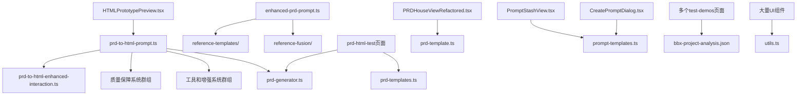

# PM Assistant 项目文件结构分析

## 📂 目录结构梳理

基于当前代码分析，以下是项目中各个目录的文件用途和依赖关系：

## 🎯 Prompts 目录 (src/prompts/)

### ✅ 正式使用的核心文件
```
prd-to-html-prompt.ts         # ✅ 主要HTML生成提示词 (7.5KB)
├─ PRD_TO_HTML_SYSTEM_PROMPT  # 主提示词模板
├─ buildPRDToHTMLPrompt()     # 提示词构建函数
├─ 集成多个增强系统模块
└─ 被组件使用: HTMLPrototypePreview.tsx

prd-to-html-enhanced-interaction.ts # ✅ 交互功能增强提示词 (25KB, 892行)
├─ ENHANCED_INTERACTION_PROMPT # 完整交互指令
├─ 数据管理系统、通用CRUD操作
└─ 被引用: prd-to-html-prompt.ts
```

### 🚀 Phase H 参考模板系统 (新增核心功能)
```
reference-templates/
├─ template-library.ts        # ✅ 模板库核心数据结构
├─ template-matcher.ts        # ✅ 智能匹配算法
├─ template-collector.ts      # ✅ 模板收集工具
└─ usage-examples.md          # ✅ 使用指南

reference-fusion/
├─ fusion-engine.ts           # ✅ 参考融合生成引擎
└─ enhanced-prd-prompt.ts     # ✅ 增强版提示词生成器 (10KB)

基于参考模板的创新策略：
- 从"零生成"升级为"参考生成" 
- 多维度智能匹配算法
- 产品类型+行业+功能+场景匹配
- 减少不确定性，提升生成质量
```

### 🛠 Phase F 质量保障系统
```
structured-prompt-framework.ts # ✅ 结构化提示词框架 (8.6KB)
├─ 结构化标签系统、思考框架
└─ 被引用: prd-to-html-prompt.ts

quality-assurance-system.ts   # ✅ 质量保障系统 (12KB) 
├─ 四层质量检查机制
├─ 自动修复系统
└─ 被引用: prd-to-html-prompt.ts

quality-execution-instructions.ts # ✅ 质量执行指令 (4.7KB)
├─ 生成流程质量检查点
├─ 问题分级处理机制
└─ 被引用: prd-to-html-prompt.ts
```

### 🔧 工具和增强系统
```
standard-data-management-tools.ts # ✅ 标准化数据管理工具库 (14KB)
├─ 通用CRUD操作、搜索过滤、状态管理
├─ 表单验证和处理系统
└─ 被引用: prd-to-html-prompt.ts

responsive-design-tools.ts    # ✅ 响应式设计工具库 (17KB)
├─ 响应式管理器、设备检测、布局适配
├─ 移动端优化和触摸手势支持
└─ 被引用: prd-to-html-prompt.ts

prd-enhancement-system.ts     # ✅ PRD数据质量增强系统 (6.6KB)
├─ 数据质量评估、智能补全、创新建议
├─ PRD优化和构建指令生成
└─ 被引用: prd-to-html-prompt.ts

business-logic-generator.ts   # ✅ 业务逻辑生成器 (32KB)
├─ 复杂业务逻辑生成的大型独立模块
├─ 专门处理业务流程和逻辑
└─ 独立使用

prd-quality-analyzer.ts       # ✅ PRD质量分析器 (23KB)
├─ 深度质量分析和评估系统
├─ 质量改进建议生成
└─ 独立质量分析功能
```

### 📁 管理和导出文件
```
index.ts                      # ✅ 统一导出接口 (496B)
types.ts                      # ✅ 类型定义 (979B)
```

### 🤔 历史遗留文件（待评估）
```
prd-prompts.ts               # ⚠️ 历史遗留 (16KB) - 被index.ts导出但与主要功能重叠
└─ 包含旧版本的PRD生成提示词，功能与prd-to-html-prompt.ts部分重叠
```

## �� Lib 目录 (src/lib/)

### 核心业务文件
```
prd-generator.ts             # ✅ PRD数据结构和类型定义
├─ PRDGenerationData接口     # 被多个组件使用
├─ 被使用于: HTMLPrototypePreview.tsx, prd-html-test页面
└─ 定义PRD数据的TypeScript类型

prd-to-build-instructions.ts # ✅ PRD数据转换层 (24KB)
├─ 产品类型推断算法
├─ 行业最佳实践模板库
└─ 智能功能增强系统

prd-html-generator.ts        # ✅ HTML生成逻辑 (8.6KB)
├─ HTML生成的核心业务逻辑
└─ 被API路由调用
```

### 通用工具文件
```
utils.ts                     # ✅ 通用工具函数
├─ shadcn/ui的cn函数等
└─ 被大量UI组件使用

ai.ts                        # ✅ AI调用封装 (5.1KB)
├─ AI服务的统一接口
└─ 被多个API路由使用

chat-history.ts              # ✅ 聊天历史管理 (4.4KB)
├─ 对话记录的持久化逻辑
└─ 功能相对独立

prompts.ts                   # ✅ 提示词服务 (22KB)
├─ 提示词生成的统一服务
└─ 被多个组件使用
```

## 📊 Data 目录 (src/data/)

### 核心模板文件
```
prd-templates.ts             # ✅ PRD模板库 (25KB)
├─ PRD_TEMPLATES导出，11种产品类型的完整模板
├─ 被使用于: prd-html-test页面
└─ 与prd-to-build-instructions.ts配合使用

prd-template.ts              # ✅ PRD基础模板 (4.3KB)
├─ prdTemplate导出
├─ 被使用于: PRDHouseViewRefactored.tsx
└─ 核心章节结构

prompt-templates.ts          # ✅ 提示词模板库 (6.2KB)
├─ getAllTemplates, searchTemplatesInList等函数
├─ 被使用于: PromptStashView.tsx, CreatePromptDialog.tsx
└─ 提示词管理功能
```

### 测试数据文件
```
bbx-project-analysis.json    # ⚠️ 测试文件 (7.7KB)
├─ 项目分析测试数据
├─ 被使用于: 多个test-demos页面
└─ 仅用于测试演示，非正式功能
```

## 🔄 依赖关系图



## 📋 文件状态总结

### ✅ 正式使用文件 (23个)
- **prompts/**: prd-to-html-prompt.ts, prd-to-html-enhanced-interaction.ts, structured-prompt-framework.ts, quality-assurance-system.ts, quality-execution-instructions.ts, standard-data-management-tools.ts, responsive-design-tools.ts, prd-enhancement-system.ts, business-logic-generator.ts, prd-quality-analyzer.ts, enhanced-prd-prompt.ts, template-library.ts, template-matcher.ts, template-collector.ts, fusion-engine.ts, index.ts, types.ts
- **lib/**: prd-generator.ts, prd-to-build-instructions.ts, prd-html-generator.ts, utils.ts, ai.ts, chat-history.ts, prompts.ts
- **data/**: prd-templates.ts, prd-template.ts, prompt-templates.ts

### 🚀 Phase H 新增功能 (5个)
- **参考模板系统**: template-library.ts, template-matcher.ts, template-collector.ts, fusion-engine.ts, enhanced-prd-prompt.ts
- **核心创新**: 基于参考模板的智能生成，从零生成升级到参考生成

### ⚠️ 待评估文件 (1个)
- **prompts/**: prd-prompts.ts (历史遗留，与主要功能部分重叠)

### 🧪 测试文件 (1个)
- **data/**: bbx-project-analysis.json (仅用于test-demos)

### ✅ 已清理完成 (2个)
- **~~franken-ui-integration.ts~~** (已手动删除) ✅
- **~~enhanced-interaction-prompt.ts~~** (已删除重复文件) ✅

## 🎯 当前架构优势

### ✅ 已完成的架构优化 (Phase F-H)
1. **模块化设计**: 功能明确分离，便于维护和扩展 ✅
2. **质量保障体系**: 四层质量检查和自动修复机制 ✅
3. **工具标准化**: 通用工具库和响应式设计工具 ✅
4. **参考模板系统**: 智能匹配和融合生成 ✅ (Phase H核心创新)
5. **代码清理**: 删除废弃和重复文件 ✅

### 🔄 持续优化方向
1. **历史遗留清理**: 评估prd-prompts.ts的使用价值
2. **测试文件管理**: 将测试数据移到专门的测试目录
3. **文档完善**: 持续更新使用指南和架构说明

## 📈 Phase H 参考模板系统总结

通过Phase H的创新开发，我们实现了：
- **创新策略**: 基于参考模板生成，减少从零开始的不确定性 ✅
- **智能匹配**: 多维度匹配算法，精准识别最适合的参考模板 ✅
- **质量提升**: 有参考基线，保证生成质量的下限 ✅
- **模块化架构**: 完整的模板库、匹配器、融合引擎体系 ✅
- **工具支持**: 快速收集和管理参考模板的工具链 ✅

这是项目的重大创新突破，为用户提供了更高质量的原型生成体验。 